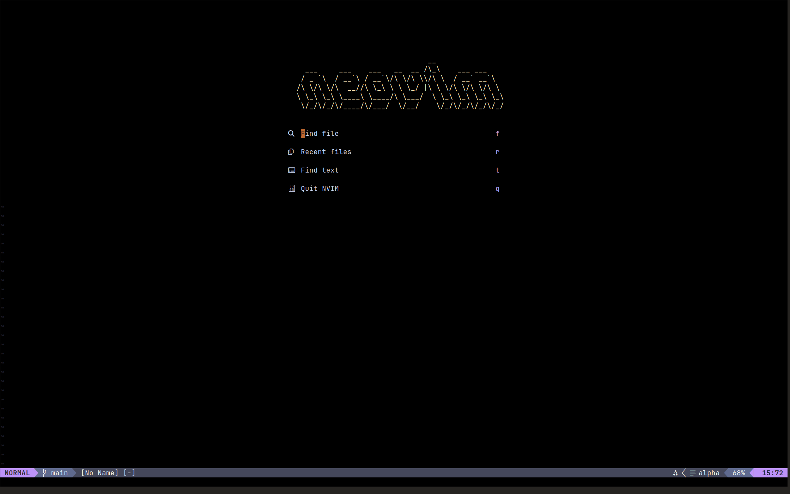
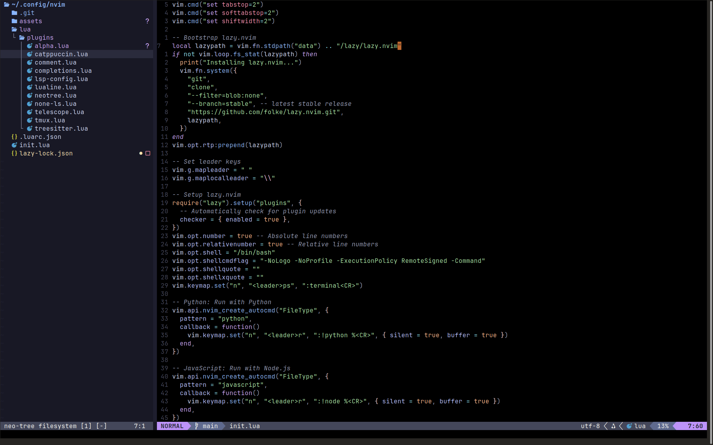

# My Neovim Configuration

<p align="center">
  
</p>

<p align="center">
  
</p>

A highly‑opinionated Neovim setup written in Lua, powered by:

- **lazy.nvim** for ultra‑fast, on‑demand plugin loading  
- **Mason** + **mason-lspconfig** for automatic LSP & tooling installs  
- **null-ls** for code formatting & linting  
- **Catppuccin Mocha** theme with true‑black background overrides  
- Treesitter, Telescope, Neo-tree, Lualine, Comment.nvim, Tmux integration, and more  

---

## 🚀 Features

- **Fast startup** via `lazy.nvim`  
- **Automatic LSP/tool installer** with `mason.nvim`  
- **Null-ls** integration for `black`, `prettier`, `stylua`, etc.  
- **Catppuccin** theme (mocha flavor) with straight `#000000` background  
- **Treesitter**-powered syntax highlighting & indentation  
- **Telescope** for fuzzy-finding files, buffers, and live grep  
- **Neo-tree** file explorer sidebar  
- **Lualine** statusline with icons & mode indicator  
- **Comment.nvim** for easy line/block commenting  
- **Tmux navigator** keybindings  
- **Built-in run commands**:  
  - `<leader>r` to run Python (`:!python %`) or JS (`:!node %`)  
  - `<leader>ps` to open an integrated terminal  
- **Absolute & relative line numbers**  
- **Bash shell** configured for Neovim commands  

---

## 📂 Repository Structure

```
~/.config/nvim/
├── init.lua                   # Entry point: bootstraps lazy.nvim & global settings
└── lua/
    └── plugins/               # Plugin specs (lazy.nvim “modules”)
        ├── alpha.lua          # Alpha-nvim startup screen config
        ├── catppuccin.lua     # Catppuccin theme + black background overrides
        ├── comment.lua        # Comment.nvim setup
        ├── completions.lua    # nvim-cmp autocompletion config
        ├── lsp-config.lua     # mason.nvim + mason-lspconfig + LSP setup
        ├── none-ls.lua        # null-ls formatting & linting
        ├── treesitter.lua     # Treesitter parser & highlight config
        ├── telescope.lua      # Telescope fuzzy finder mappings
        ├── neotree.lua        # Neo-tree file explorer sidebar
        ├── lualine.lua        # Lualine statusline config
        └── tmux.lua           # Tmux navigator keybindings
```

---

## ⚙️ Prerequisites

- **Neovim** ≥ 0.8  
- **Git**  
- **Node.js** (for `prettier`, `eslint`)  
- **Python 3** (for `black`, `pyright`)  
- (Optional) **Nerd Font** for icons in statusline and Telescope  

---

## 💻 Installation

1. **Clone** this repo into your Neovim config directory:

   ```bash
   git clone https://github.com/stanleyavril123/nvim-config.git ~/.config/nvim
   ```

2. **Open Neovim** — `lazy.nvim` will auto-install all plugins on first run.

3. **Install LSPs & tools** with Mason:

   ```vim
   :Mason
   ```

   Select the servers and formatters you need (e.g. `lua-language-server`, `pyright`, `tsserver`, `black`, `prettier`).

4. **(Optional) Install Treesitter parsers:**

   ```vim
   :TSInstall python javascript lua
   ```

---

## 🎨 Theme & Background

This setup uses **Catppuccin Mocha** with a **transparent** background so your terminal/Kitty wallpaper shows through.

**Config:** `lua/plugins/catppuccin.lua`
```lua
return {
  {
    "catppuccin/nvim",
    name = "catppuccin",
    priority = 1000,
    config = function()
      vim.opt.termguicolors = true
      vim.opt.background = "dark"

      require("catppuccin").setup({
        flavour = "mocha",
        transparent_background = true,          -- terminal background shows through
        custom_highlights = function(cp)
          return {
            WinSeparator = { fg = cp.surface1, bg = "NONE" },
          }
        end,
      })

      vim.cmd.colorscheme("catppuccin")
    end,
  },
}
```

---

## 🤖 LSP, Formatting & Linters

- **`lsp-config.lua`**  
  - Boots `mason.nvim` & `mason-lspconfig`  
  - Ensures servers: `pyright`, `tsserver`, `lua_ls`, etc.  
  - Configures handlers, capabilities, keymaps  

- **`none-ls.lua`** (null-ls)  
  - Hooks into `null-ls.nvim`  
  - Registers formatters & linters (Prettier, Black, Stylua…)  

Sample from `lsp-config.lua`:

```lua
require("mason").setup()
require("mason-lspconfig").setup({ ensure_installed = { "pyright", "tsserver", "lua_ls" } })
```

Sample from `none-ls.lua`:

```lua
local null_ls = require("null-ls")
null_ls.setup({
  sources = {
    null_ls.builtins.formatting.prettier,
    null_ls.builtins.formatting.black,
  },
})
```

---

## ⌨️ Keybindings & Workflow

- **Space** is your `<leader>`  
- `<leader>ps` → open floating terminal (`:terminal`)  
- `<leader>r` → run current buffer (`python` or `node`)  
- **Telescope** shortcuts in `telescope.lua` (e.g. `<leader>ff`, `<leader>fg`)  
- **Comment.nvim** uses `gc`/`gb` to toggle comments  

---

## 📜 License

This configuration is released under the **MIT License**.  
See [LICENSE](LICENSE) for details.

---
