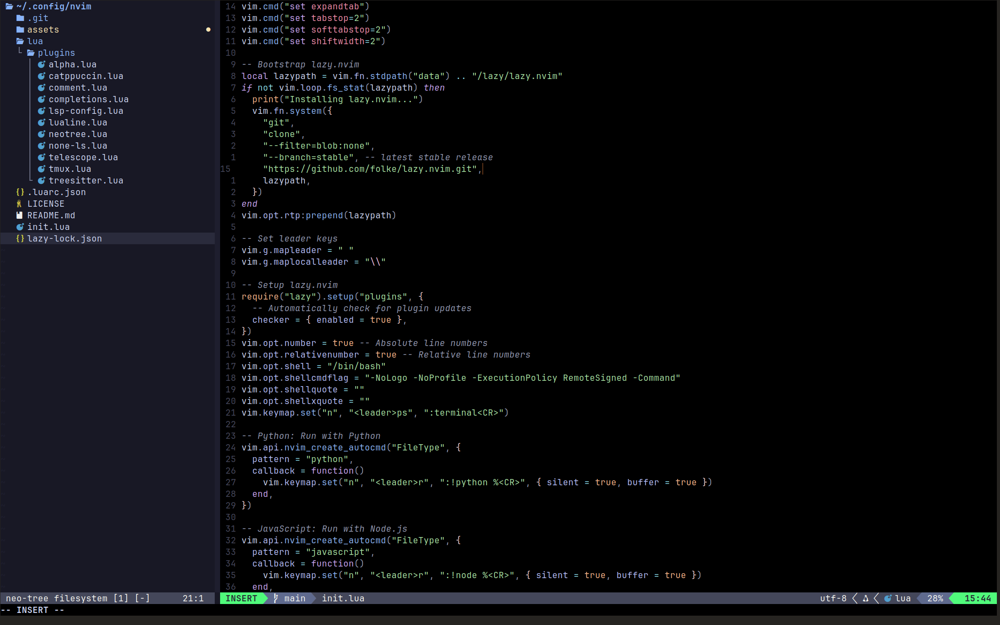

# Neovim Config

<p align="center">
  
</p>

<p align="center">
  
</p>

Neovim configuration written in Lua.

Includes:
- Plugin management via **lazy.nvim**
- LSP/tooling via **mason.nvim** + **mason-lspconfig**
- Formatting/linting via **none-ls** (null-ls)
- **Catppuccin (mocha)** theme
- Treesitter, Telescope, Neo-tree, Lualine, Comment.nvim, and tmux navigation

---

## Features

- Lazy-loaded plugins
- LSP setup + automated installs through Mason
- Formatters/linters through none-ls (e.g. Prettier, Black, Stylua)
- Treesitter syntax highlighting
- Telescope fuzzy finding
- Neo-tree file explorer
- Lualine statusline
- Comment.nvim (`gc`, `gb`)
- Tmux navigator bindings
- Simple run commands:
  - `<leader>r` runs `python %` or `node %`
  - `<leader>ps` opens a terminal

---

## Structure

```
~/.config/nvim/
├── init.lua
└── lua/
    └── plugins/
        ├── alpha.lua
        ├── autopairs.lua
        ├── catppuccin.lua
        ├── comment.lua
        ├── completions.lua
        ├── lsp-config.lua
        ├── none-ls.lua
        ├── treesitter.lua
        ├── telescope.lua
        ├── neotree.lua
        ├── lualine.lua
        └── tmux.lua
```

---

## Requirements

- Neovim ≥ 0.8
- Git
- Node.js (for tools like Prettier / ESLint)
- Python 3 (for tools like Black / Pyright)
- Optional: Nerd Font for icons

---

## Installation

```bash
git clone https://github.com/stanleyavril123/nvim-config.git ~/.config/nvim
```

Open Neovim. Plugins will install automatically.

---

## Tooling

### Mason
Open Mason and install what you need:

```vim
:Mason
```

Common:
- LSP: `lua-language-server`, `pyright`, `tsserver`
- Formatters: `stylua`, `black`, `prettier`

### Treesitter
Install parsers as needed:

```vim
:TSInstall lua python javascript
```

---

## Theme

Catppuccin Mocha is configured in `lua/plugins/catppuccin.lua`.

If you prefer a transparent background (terminal background shows through), keep:
```lua
transparent_background = true
```

If you want Neovim to draw its own background, set it to `false`.

---

## LSP & formatting

- LSP configuration: `lua/plugins/lsp-config.lua`
- none-ls configuration: `lua/plugins/none-ls.lua`

Manual formatting (example):
- `<leader>gf` → format buffer

If you want *format on save*, add a `BufWritePre` autocmd.

---

## License

MIT — see [LICENSE](LICENSE).
